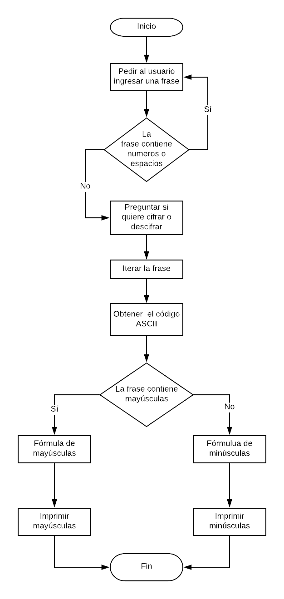

 # Mayúsculas a minúsculas

 ### Descripción
Convertir las letras mayúsculas de un string a minúsculas, por medio de una función.

## Pseudocódigo
### Descripción

1. Pedir el string.

2. Validar que el string solo contenga letras.

3. Identificar las letras mayúsculas del string.

4. Crear una función que transforme las mayúsculas a minúsculas.

5. Regresar el resultado.

